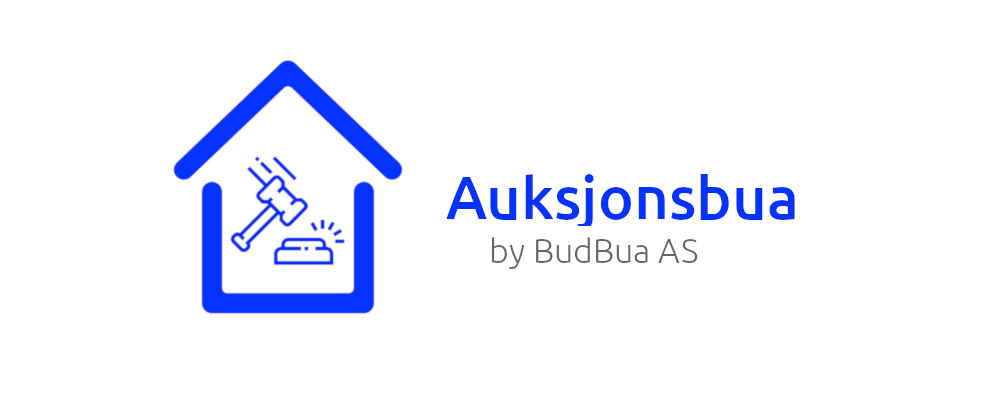

# 

[](https://gitlab.stud.idi.ntnu.no/programvareutvikling-v19/gruppe-67/pipelines)
[](https://en.wikipedia.org/wiki/MIT_License)


[](https://github.com/prettier/prettier)
[](https://github.com/ambv/black)
[](https://www.python.org/dev/peps/pep-0008/)

## What is this?

Auksjonsbua is a website for holding auctions and is hosted by BudBua AS, the biggest and oldest auction market in Norway. Anyone can create a user and create auctions, or bid on other auctions. It comes with an admin panel and a statistics page for viewing details and administrating the page for admins, and a dashboard for users.

## Preview

[See the live webside here](https://auksjonsbua.herokuapp.com/)

# 

## Technology

<b>Built with</b>

- [React 16](https://reactjs.org/) and [React Redux](https://react-redux.js.org/)
- [Django 2](https://www.djangoproject.com/) and [Django REST Framework](https://www.django-rest-framework.org/)

## Installation

The setup of this project is divided into two parts: The [backend](https://gitlab.stud.idi.ntnu.no/programvareutvikling-v19/gruppe-67/tree/master/backend) and the [webapp](https://gitlab.stud.idi.ntnu.no/programvareutvikling-v19/gruppe-67/tree/master/webapp).

<b>All commands are entered in a terminal.</b> For Windows we recommend using PyCharm's terminal for ease of setup.

#### Pre-Requirements

Please ensure you have a working installation of

- [Python 3.6](https://www.python.org/) or above and
- [Node 8](https://nodejs.org/en/) or above

as this is the base for our project and it has not been tested on earlier versions.

### Setting up the backend

1. Create a virtual environment to contain our packages. You can do this through an IDE such as [PyCharm](https://www.jetbrains.com/pycharm/) (especially nice for Windows users), or create it with [`virtualenv`](https://virtualenv.pypa.io/en/stable/) as shown below.

```sh
$ cd backend
$ virtualenv -p python3.6 venv     # Create a virtual environment
$ source venv/bin/activate       # or on Windows: $ source venv/Scripts/activate
```

2. Make sure you are in the `backend` folder, and then install the packages and run the development server:

```sh
$ pip install -r requirements.txt      # Install the required packages
$ python manage.py migrate             # Create the tables in the db
$ python manage.py runserver           # Run the development server
```

Now the backend should be up and running on [localhost:8000](http://localhost:8000/) and exposing its browsable API.

For more details on the backend, [see our README in the `backend` folder](backend/README.md)

3. Loading fixtures - The database is still empty, so we offer two solutions to quickly fill it with some data for testing purposes. (see below)

###### Loading fixtures

Creates a superuser, a owner user (staff but not superuser) and two regular users all with the password "password123", in addition to some auctions.

```sh
$ python manage.py loaddata **/fixtures/*.yaml
```

### Setting up the webapp

1. Open a new terminal (don't close the one running the backend).

2. Install the packages and run the development server:

```sh
$ cd webapp           # Enter the correct folder
$ npm i               # Install the required packages
$ npm start           # Run the development server
```

Now the webapp should be up and running on [localhost:3000](http://localhost:3000/) and should be able to connect with the backend you already set up.

For more details on the webapp, [see our README in the `webapp` folder](webapp/README.md)

<b>Note on setting up the project on Windows:</b>
If you already have a Python 3.6+ with virtualenv and a Node environment set up on your Windows machine, running this project should be as easy as the above. But if you run into some problems that are not related to the project, the internet is your best friend, but you may also post an issue if you think it is related to setting up the project in general on Windows.

## Some usage notes

Access the admin panel on [localhost:8000/admin/](localhost:8000/admin/) and log in with a superuser.

If you login on the webapp with an admin or owner user, you can see the "Statistics" page.

## Tests

### backend

Run the tests with

##### `python manage.py test`

To see if your backend code follows our codestyle, run these commands

```sh
$ isort -c -rc auction
$ black --check auction
```

You can fix the codestyle errors by running this

```sh
$ isort -rc auction
$ black auction
```

### webapp

Run the tests with

##### `npm run test`

and

##### `npm run cypress`

To see if your frontend code follows our codestyle, run this command

```sh
$ npm run lint
```

You can fix the codestyle errors by running this

```sh
$ npm run prettier
```

## Deploying

We recommend [Heroku](https://www.heroku.com) for easy deployment. We have setup CI/CD such that when you push to the `prod`-branch, it adds the `deploy` step which runs after the tests succeed. For this to work you must change these lines in the `.gitlab-ci.yml` file to match your Heroku app names.

Backend app

```yaml
dpl --provider=heroku --app=<name of backend app on heroku> --api-key=$HEROKU_API_KEY
```

Frontend app (code must be free of linting errors)

```yaml
dpl --provider=heroku --app=<name of frontend app on heroku> --api-key=$HEROKU_API_KEY
```

`$HEROKU_API_KEY` is the secret API token connected to your Heroku account, and is set in GitLab's environment variables settings. If this token is not set, the pipeline will not succeed when deploying.

## Contribute

If you encounter any issues, have any questions or want to make a change to the application, you are welcome to contribute. Please read our [contributing guidelines](CONTRIBUTING.md) to find out how to get started.

## The Team

[Sigrid Marita Kvamme](https://github.com/cherrybeans)
| [Katrine Gjerde](https://gitlab.stud.idi.ntnu.no/katrinjg) | [Henrik Grüner](https://gitlab.stud.idi.ntnu.no/henrgr) | [Viggo Skarby](https://gitlab.stud.idi.ntnu.no/viggosk) | [Martin Kvalheim](https://gitlab.stud.idi.ntnu.no/martkval) | [Håvard Lund](https://gitlab.stud.idi.ntnu.no/haavalu)

## License

BudBua supports open source code and has made this project available with the [MIT license](LICENSE).

MIT © [BudBua AS](https://auksjonsbua.herokuapp.com/)
