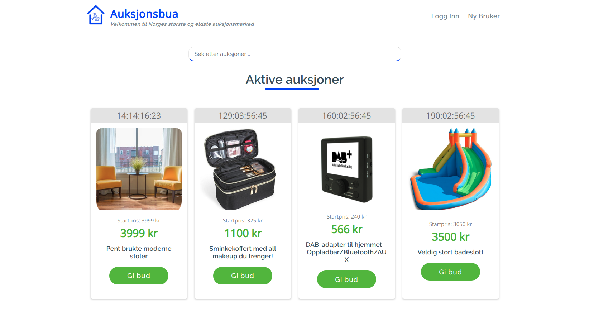

# 

[](https://gitlab.stud.idi.ntnu.no/programvareutvikling-v19/gruppe-67/pipelines)
[](https://en.wikipedia.org/wiki/MIT_License)


[](https://github.com/prettier/prettier)
[](https://github.com/ambv/black)
[](https://www.python.org/dev/peps/pep-0008/)

## What is this?
Auksjonsbua er en nettside for auksjoner og er eid av BudBua AS, den største og eldste auksjonsdriveren i Norge. Hvem som helst kan opprette en bruker og lage auksjoner, eller by på andres auksjoner. Siden kommer med et admin-panel og en statistikk side for eieren, og en egen brukerside med detaljer.
Auksjonsbua is a website for holding auctions and is hosted by BudBua AS, the biggest and oldest auction market in Norway. Anyone can create a user and create auctions, or bid on other auctions. It comes with an admin panel and a statistics page for viewing details and administrating the page for admins, and a dashboard for users.

## Preview

[See the live webside here](https://auksjonsbua.herokuapp.com/)

# 

## Technology

<b>Built with</b>

- [React 16](https://reactjs.org/) and [React Redux](https://react-redux.js.org/)
- [Django 2](https://www.djangoproject.com/) and [Django REST Framework](https://www.django-rest-framework.org/)

## Installation
Oppsettet av prosjektet er delt i to deler: [backend](https://gitlab.stud.idi.ntnu.no/programvareutvikling-v19/gruppe-67/tree/master/backend) og [webapp](https://gitlab.stud.idi.ntnu.no/programvareutvikling-v19/gruppe-67/tree/master/webapp).
The setup of this project is divided into two parts: The [backend](https://gitlab.stud.idi.ntnu.no/programvareutvikling-v19/gruppe-67/tree/master/backend) and the [webapp](https://gitlab.stud.idi.ntnu.no/programvareutvikling-v19/gruppe-67/tree/master/webapp).
<b>All kommandoer skrives inn i terminal.</b> For Windows anbefaler vi PyCharms terminal for enklere oppsett.
<b>All commands are entered in a terminal.</b> For Windows we recommend using PyCharm's terminal for ease of setup.

#### Pre-Requirements
Pass på at du har en fungerende installasjon av : 
Please ensure you have a working installation of

- [Python 3.6](https://www.python.org/) or above and
- [Node 8](https://nodejs.org/en/) or above

Dette er basen til prosjektet, og har ikke blitt testet på tidligere versjoner.
as this is the base for our project and it has not been tested on earlier versions.

### Setting up the backend
1. Sett opp et "virtual environment" for å inneholde våre pakker. Dette kan gjøres gjennom en IDE slik som  [PyCharm](https://www.jetbrains.com/pycharm/) (spesielt hendig for Windows-brukere), eller opprett med [`virtualenv`](https://virtualenv.pypa.io/en/stable/) som vist under.

1. Create a virtual environment to contain our packages. You can do this through an IDE such as [PyCharm](https://www.jetbrains.com/pycharm/) (especially nice for Windows users), or create it with [`virtualenv`](https://virtualenv.pypa.io/en/stable/) as shown below.

```sh
$ cd backend
$ virtualenv -p python3.6 venv     # Create a virtual environment
$ source venv/bin/activate       # or on Windows: $ source venv/Scripts/activate
```
2. Pass på at du er i  `backend` mappen, og deretter installer pakken og kjør utviklingsserveren:

2. Make sure you are in the `backend` folder, and then install the packages and run the development server:

```sh
$ pip install -r requirements.txt      # Install the required packages
$ python manage.py migrate             # Create the tables in the db
$ python manage.py loaddata **/fixtures/*.yaml  # Fill the db with test data, may skip this.
$ python manage.py runserver           # Run the development server
```

Nå som backend bør være oppe å kjøre på [localhost:8000](http://localhost:8000/) og viser sin søkbare API.
Now the backend should be up and running on [localhost:8000](http://localhost:8000/) and exposing its browsable API.

For mer detaljer på backend [see our README in the `backend` folder](backend/README.md)
For more details on the backend, [see our README in the `backend` folder](backend/README.md)

### Setting up the webapp
1. Åpne en ny terminal ( Ikke lukk den som kjører backend)
1. Open a new terminal (don't close the one running the backend).
2. Installer pakkene og start utviklingsserveren:
2. Install the packages and run the development server:

```sh
$ cd webapp           # Enter the correct folder
$ npm i               # Install the required packages
$ npm start           # Run the development server
```
Nå som webappen bør være oppe å kjøre på [localhost:3000](http://localhost:3000/) og skal ha muligheten for å koble sammen med backend som allerede har blitt satt opp.
Now the webapp should be up and running on [localhost:3000](http://localhost:3000/) and should be able to connect with the backend you already set up.

For mer detaljer på webapp, se [see our README in the `webapp` folder](webapp/README.md)
For more details on the webapp, [see our README in the `webapp` folder](webapp/README.md)

<b>NB for oppsett på Windows:</b>
Hvis du allerede har Python 3.6+ med virtualenv og et Node environment oppsatt på din Windows maskin, kjøre prosjektet burde være like lett som vist over. Men hvis du støtet på problemer urelatert til prosjektet, er internett din beste venn, men du kan også opprette en issue hvis du tror det er relatert til å sette opp prosjektet generelt på Windows.

<b>Note on setting up the project on Windows:</b>
If you already have a Python 3.6+ with virtualenv and a Node environment set up on your Windows machine, running this project should be as easy as the above. But if you run into some problems that are not related to the project, the internet is your best friend, but you may also post an issue if you think it is related to setting up the project in general on Windows.

## Noen praktiske notater
## Some usage notes

Tilgang til admin-panelet på [localhost:8000/admin/](localhost:8000/admin/) og logg inn med en superuser.

Access the admin panel on [localhost:8000/admin/](localhost:8000/admin/) and log in with a superuser.

Hvis du logger inn med en admin- eller eier-bruker, kan du se "statistikk"-siden. 
If you login on the webapp with an admin or owner user, you can see the "Statistics" page.

## Tests
## tester

### Backend

Run the tests with
Kjør testene med

##### `python manage.py test`

For å sjekke om backenden følger standarden for kodestil, kjør følgende kommandoer
To see if your backend code follows our codestyle, run these commands

```sh
$ isort -c -rc auction
$ black --check auction
```
Du kan fikse kodestilfeil med å kjøre dette:
You can fix the codestyle errors by running this

```sh
$ isort -rc auction
$ black auction
```

### Webapp

Kjør testene med
Run the tests with

##### `npm run test`

og
and

##### `npm run cypress`

For å se om frontend-koden følger definert standard for kodestil, kjør følgende kommando:
To see if your frontend code follows our codestyle, run this command

```sh
$ npm run lint
```
Du kan fikse kodestil-feil ved å kjøre dette:
You can fix the codestyle errors by running this

```sh
$ npm run prettier
```

## Deploying

Vi anbefaler [Heroku](https://www.heroku.com) for lett deployment. Vi har satt opp CI/CD slik at når vi pusher til "prod"-branch,  legger den til "deploy"-steg som kjører kun hvis testene er vellykket. For at dette skal fungere må følgende linjer i `.gitlab-ci.yml´-filen endres til å være lik Heroku-app navnene.
We recommend [Heroku](https://www.heroku.com) for easy deployment. We have setup CI/CD such that when you push to the `prod`-branch, it adds the `deploy` step which runs after the tests succeed. For this to work you must change these lines in the `.gitlab-ci.yml` file to match your Heroku app names.

Backend app

```yaml
dpl --provider=heroku --app=<name of backend app on heroku> --api-key=$HEROKU_API_KEY
```
Frontend app (koden kan ikke ha "linting"- errors)
Frontend app (code must be free of linting errors)

```yaml
dpl --provider=heroku --app=<name of frontend app on heroku> --api-key=$HEROKU_API_KEY
```

`$HEROKU_API_KEY` is the secret API token connected to your Heroku account, and is set in GitLab's environment variables settings. If this token is not set, the pipeline will not succeed when deploying.

## Contribute
Hvis du møter på problemer, har noen spørsmål eller ønsker om endringer til applikasjonen er du velkommen til å bidra. Vennligst les vår [contributing guidelines](CONTRIBUTING.md) for å finne ut hvordan man starter opp.
If you encounter any issues, have any questions or want to make a change to the application, you are welcome to contribute. Please read our [contributing guidelines](CONTRIBUTING.md) to find out how to get started.

## The Team
## Laget 
[Sigrid Marita Kvamme](https://github.com/cherrybeans)
| [Katrine Gjerde](https://gitlab.stud.idi.ntnu.no/katrinjg) | [Henrik Grüner](https://gitlab.stud.idi.ntnu.no/henrgr) | [Viggo Skarby](https://gitlab.stud.idi.ntnu.no/viggosk) | [Martin Kvalheim](https://gitlab.stud.idi.ntnu.no/martkval) | [Håvard Lund](https://gitlab.stud.idi.ntnu.no/haavalu)

## License
## Lisense

BudBua støtter åpen kildekode og har laget prosjektet tilgjengelig med [MIT license](LICENSE).
BudBua supports open source code and has made this project available with the [MIT license](LICENSE).

MIT © [BudBua AS](https://auksjonsbua.herokuapp.com/)
